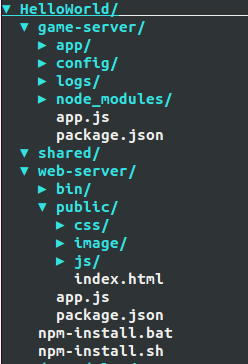
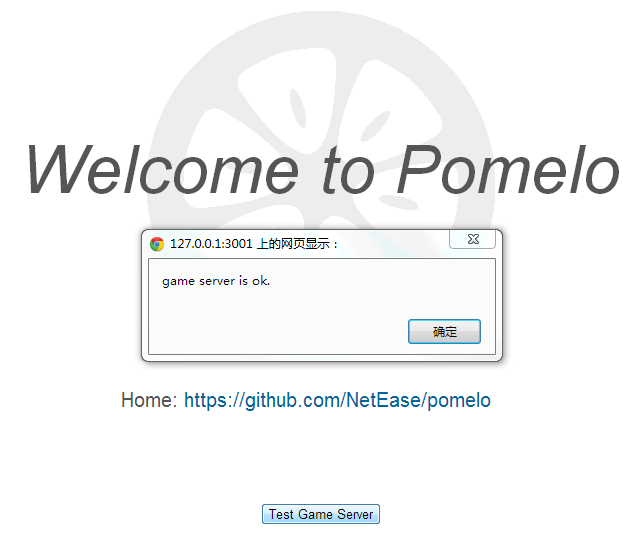
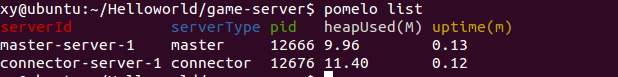

title: 快速入门
---

## 环境依赖

操作系统：支持 macOS，Linux，Windows
运行环境：node.js建议选择 LTS 版本，最低要求 8.x 

## 安装

Pinus 可以直接安装在应用程序中，也可以安装在全局。

```sh
npm i pinus -g  // 安装在全局
npm i pinus --save   // 安装在应用
```

## 新建项目

使用pinus的命令行工具可以快速创建一个项目，命令如下：

    $ pinus init ./HelloWorld

或者你也可以使用下面的三个命令：

    $ mkdir HelloWorld
    $ cd HelloWorld
    $ pinus init

这两种创建方式是等价的，更多关于pinus命令行使用的文档，请参阅[pinus命令行工具使用](pinus命令行工具使用)。在初始化项目的时候，用户需要选择其底层使用的通信协议（**暂时只支持1 websocket模式**），分为socket.io和websocket。

然后，进入到HelloWorld文件夹，安装依赖包：

    $ sh npm-install.sh

windows用户，可以直接运行 `npm-install.bat`

## 项目目录结构

让我们来看看一个pinus项目的大致结构

新建立的项目结构如下图所示：



该目录结构很清楚地展示了游戏项目的前后端分层结构，分别在各个目录下填写相关代码，即可快速开发游戏。下面对各个目录进行简要分析：

#### game-server
game-server是用pinus框架搭建的游戏服务器，以文件app.js作为入口，运行游戏的所有逻辑和功能。在接下来的开发中，所有游戏逻辑、功能、配置等都在该目录下进行。

* app子目录

这个目录下放置所有的游戏服务器代码的地方，用户在这里实现不同类型的服务器，添加对应的Handler，Remote等等。


* config子目录

game-server下config包括了游戏服务器的所有配置信息。配置信息以JSON文件的格式进行定义，包含有日志、master、server等服务器的配置信息。该目录还可以进行扩展，对数据库配置信息、地图信息和数值表等信息进行定义。总而言之，这里是放着所有游戏服务器相关的配置信息的地方。

* logs子目录

日志是项目中不可或缺的，可以对项目的运行情况进行很好的备份，也是系统运维的参考数据之一，logs存放了游戏服务器所有的日志信息。

#### shared

shared存放一些前后端、game-server与web-server共用代码，由于都是javascript代码，那么对于一些工具或者算法代码，就可以前后端共用，极大地提高了代码重用性。

#### web-server

web-server是用[express 3.x](http://expressjs.com)框架搭建的web服务器，以文件app.js作为入口，当然开发者可以选择Nginx等其他web服务器。如果游戏的客户端不是web的话，如Android平台的话，这个目录就不是必须的了。当然，在这个例子中，我们的客户端是web，所以web服务器还是必须的。

## 启动项目

对于我们这个例子来说，由于客户端是web，所以必须启动game-server(游戏服务器)和web-server(web服务器)

编译game-server服务器：

    $ cd game-server
    $ npm run build

启动game-server服务器：

    $ cd dist
    $ pinus start

启动web-server服务器：

    $ cd web-server
    $ node app 


在启动过程中可能会有端口号冲突导致启动不成功，只需在config里面修改使用的端口号即可。如果上面的启动都没有问题的话，我们就可以对我们的HelloWorld进行测试了。用浏览器(推荐使用chrome)访问 `http://localhost:3001`或者 `http://127.0.0.1:3001` 即可, 点击Test Game Server，提示 *game server is ok* 说明运行成功，如下图所示：



## 查看服务器

可以使用`pinus list`查看已经启动的服务器，如下图所示：

 

服务器状态可以查看5种状态信息：

* serverId：服务器的serverId，同config配置表中的id。
* serverType：服务器的serverType，同config配置表中的type。
* pid：服务器对应的进程pid。
* heapUsed：该服务器已经使用的堆大小（单位：兆）。
* uptime：该服务器启动时长（单位：分钟）。

## 关闭项目

可以使用以下两种方式关闭项目：

    $ cd game-server/dist
    $ pinus stop

或者

    $ cd game-server/dist
    $ pinus kill

其中`pinus stop`比较优雅，`pinus kill`比较粗暴，安全性低，开发环境下可以使用，产品环境慎用，更详细的pinus命令行用法请参阅[pinus命令行工具使用](pinus命令行工具使用)。

## 小结

到这里为止，我们已经成功安装了pinus，并成功运行了HelloWorld。接下来，建议你看一下pinus整体的一个较详细的概述。
如果你已经迫不及待地想写代码，可以去pinus例子教程, 那里以一个chat应用为例，一步一步地向你展示如何来使用pinus进行一个实际应用的开发，以及pinus的一些API的使用方式等。
